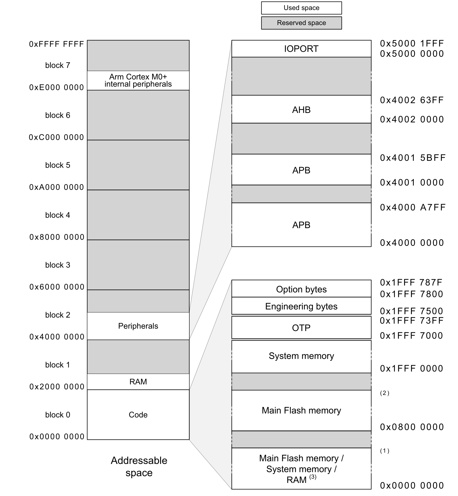
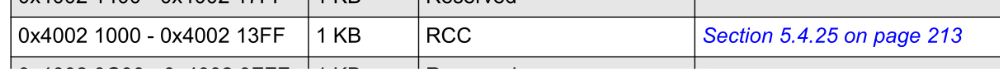
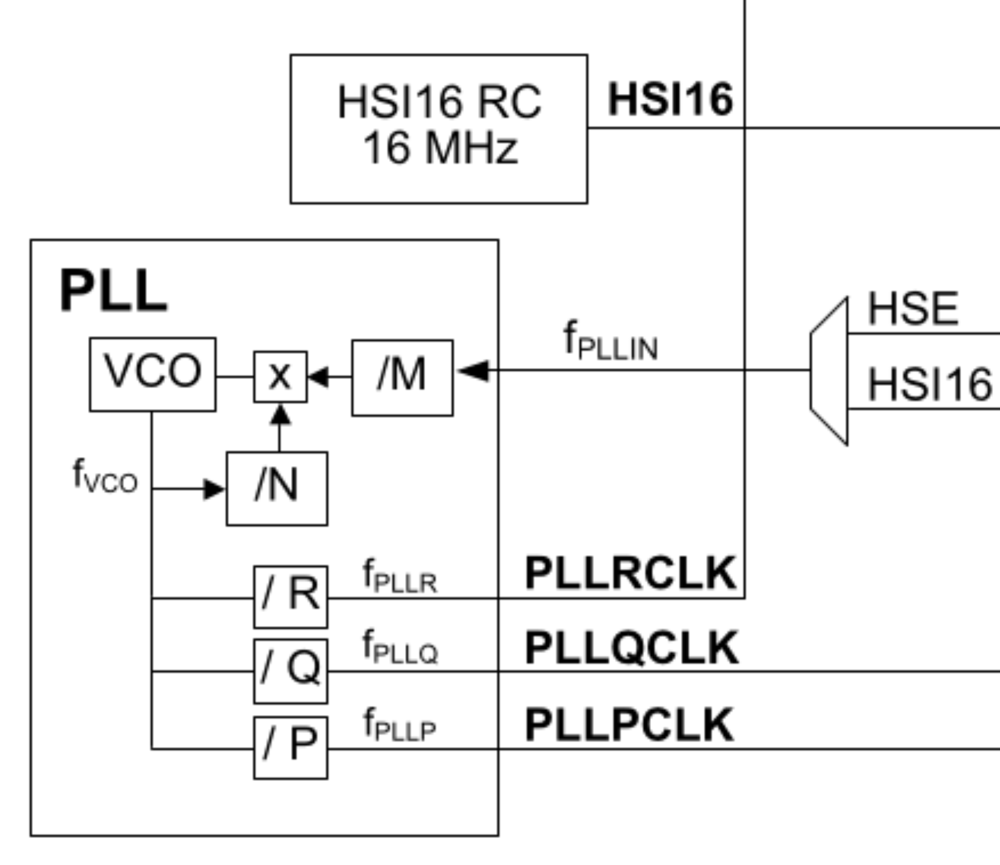

+++
title = 'STM32: Setting up an IDE-free environment'
date = 2024-12-20T09:00:00-07:00
draft = false
tags = ['arm','stm32','embedded']
+++

> [!NOTE] **The problem** 
> The necessity to write my own startup code for a microcontroller I was working on, specifically STM32G0B1RE

> [!CAUTION] Why? 
>    I don't like to work with IDEs and I want my workflow to be as straightforward as possible. 
>    I also don't want to make a wrapper over the CMSIS headers as my intention is to use only the neccesary peripherals.

> [!TIP] How? \
>     In what follows I will describe the steps needed to reproduce my setup and also the documentation required for understanding the concepts.
>     We will build a linker script from scratch following the memory organization and register address boundaries specified in the  reference manual. We will then create the table of interrupt vectors and define the code to be executed by the `Reset_Handler`.  Afterwards, to automate the building process I will provide a custom `Makefile`.

## References
  - [STM32G0x1xx Reference Manual](https://www.st.com/resource/en/reference_manual/rm0444-stm32g0x1-advanced-armbased-32bit-mcus-stmicroelectronics.pdf)
    * Memory Organization (Chapter 2.2.2 Memory map and register boundary addresses - **pg. 62**)
    * System Clock Selection (Chapter 5. Reset and clock control (RCC) - **pg. 155**)
  - [STM32 Cortex-M0/M0+ Programming Manual](https://www.st.com/resource/en/programming_manual/pm0223-stm32-cortexm0-mcus-programming-manual-stmicroelectronics.pdf)
  - [ARMv6-M Architecture Reference Manual](https://www.google.com/url?sa=t&source=web&rct=j&opi=89978449&url=https://users.ece.utexas.edu/~valvano/mspm0/Arm_Architecture_v6m_Reference_Manual.pdf&ved=2ahUKEwjn54aZnLmKAxX4nf0HHYpSDTkQFnoECBIQAQ&usg=AOvVaw1wJfJ_0J4djK_M9sc94aE1)

##  Dependencies

  - [STM32 Programming Toolset](https://github.com/stlink-org/stlink) + dependencies
    ```bash
    sudo apt-get install git make cmake libusb-1.0-0-dev
    sudo apt-get install gcc build-essential

    wget https://github.com/stlink-org/stlink/releases/download/v1.8.0/stlink_1.8.0-1_amd64.deb -q --show-progress
    sudo dpkg -i stlink_1.8.0-1_amd64.deb
    ```
    Connect the board to an USB port and to test its connectivity you can execute the followind command:
    
    ```bash
    lsusb | grep STM 
    Expected output: STMicroelectronics ST-LINK/V2.1
    ```

    The **COM LED** should also be **green**.
    A problem with USB enumeration is indicated by a blinking red **COM LED**.

    To see more specific information about the board you can execute the following command:
    ```bash {hl_lines=["6-7"]}
    st-info --probe

    Found 1 stlink programmers
        version:    V2J37S27
        serial:     066BFF373146363143223537
        flash:      524288 (pagesize: 2048) (512KB)
        sram:       147456 (144KB)
        chipid:     0x467
        dev-type:   STM32G0Bx_G0Cx
    ```

## ARM Cortex-M0+ Reset Behavior

The Cortex-M0+ has the following reset behavior according to this well documented presentation [here](https://www.google.com/url?sa=t&source=web&rct=j&opi=89978449&url=https://community.arm.com/support-forums/f/soc-design-and-simulation-forum/54006/understanding-reset-sequence-cortex-m0&ved=2ahUKEwjPjMOM3riKAxUfiv0HHXUTGkEQFnoECBcQAQ&usg=AOvVaw0FCZVU6DNUNLWvWUzluuz3):
  - Reads the **Initial SP**, also called the **MSP (Main Stack Pointer)** 
  - Reads the **reset vector**
  - Branches to the starting of the program execution address (**reset handler**)
  - Subsequently executes program instructions (TBD in the `Reset_Handler` function)


## Reset_Handler
  A strong reference point was [this forum post](https://allthingsembedded.com/post/2019-01-03-arm-cortex-m-startup-code-for-c-and-c/) and also [this implementation](https://github.com/elzoughby/STM32H7xx-Startup/tree/master) for the **STM32H7xx** series.

  1. Define the interrupt vector table for the NVIC according to the Cortex-M0+ Manual and STM32G0x1xx series reference Manual.

  ```c
  void (* g_pfnVectors[])(void) __attribute__((section (".isr_vector"))) = {...}
  ```
  2. Move the **MSP** to the **SP (Stack Pointer**) using inline assembly and `LDR` instruction _(see page 141 from ARMv6-m Architecture Manual)_. It uses the `_estack` symbol defined in the linker script.

  ```c
  __asm (
        "LDR R0, =_estack       \n\t"
        "MOV SP, R0             \n\t"
    );
  ```
  3. Initialize the `.data` section. In order to use symbols from the ``.data`` section, the startup code needs to copy the data from ``LMA (Flash)`` to ``VMA (SRAM)`` to make sure that all C code can access the initialized data. It uses the `_data_start`, `data_end` symbols for the virtual adresses and `_sidata` symbol for the start address of the LMA of the `.data` section.

  ```c
  uint32_t *dataSrc = &_sidata, *dataDest = &_data_start;
    while (dataDest < &_data_end) {
        *dataDest++ = *dataSrc++;
    }
  ```
  4. Initialize the `.bss` section to zero using inline assembly. It uses the `_bss_start` and `_bss_end` symbols defined in the linker script.

  ```c
    __asm (
        "LDR R0, =_bss_start      \n\t"
        "LDR R1, =_bss_end        \n\t"
        "MOV R2, #0               \n\t"
        "loop_zero:               \n\t"
        "   CMP 	R0, R1          \n\t"
        "   BGE 	end_loop        \n\t"
        "   STR	R2, [R0]        \n\t"
        "   ADD   R0, R0, #4      \n\t"
        "   B 	loop_zero       \n\t"
        "end_loop:                \n\t"
    );
  ```

## Linker Script

Linking is the last step in the compilation of a program. It takes a number of object files and merges them into a single executable or binary file.

The *linker script* is a file made up of a series of linker directives that tells the linker (`arm-none-eabi-gcc` in our case) which sections to include in the output file, as well as which order to put them in, what type of file is to be produced, and what is to be the address of the first instruction.

A linker script (**.ld**) is comprised of four sections:
  - Memory layout in which we describe, not define, the attributes of a memory zone (read, write, execute), the origin address and the lenngth of the area

  

  ```LD
MEMORY {
    FLASH (rx)      : ORIGIN = 0x08000000, LENGTH = 512K   
    SRAM  (xrw)     : ORIGIN = 0x20000000, LENGTH = 144K
}
  ```
  - Section definitions which describe how the sections form the input object files will be mapped to sections inside the output file
  ```LD
SECTIONS {
    .isr_vector : {
        KEEP(*(.isr_vector))
    } >FLASH

    .text : {
        . = ALIGN(4);
        *(.text)
        *(.text*)
        . = ALIGN(4);
        _etext = .;
    } >FLASH

    ...
}
  ```
  - Options: commands to specify architecture, entry point, …etc. if needed
  ```LD
  ENTRY(Reset_Handler)

  OUTPUT_FORMAT ("elf32-littlearm")
  ```
  - Symbols: variables to inject into the program at link time
  ```LD
  _estack = ORIGIN(SRAM) + LENGTH(SRAM);
  ```

The entire *linker script* can be found on my **Github repository**.

| **KEYWORD** | **DESCRIPTION**                                                                                                                                                                       |
|-------------|---------------------------------------------------------------------------------------------------------------------------------------------------------------------------------------|
| `SECTIONS`  | Defines the mapping between the sections of the input object files to the sections of the linker's output file, by specifying the memory layout of each output section.                |
| `KEEP`      | Tells the linker to not remove the section wrapped by this command. Important when working with ARM microprocessors because the interrupt vector table must be in a predefined memory location and is not referenced directly by code. |
| `LMA`       | Load Memory Address.                                                                                                                                                                  |
| `VMA`       | Virtual Memory Address.                                                                                                                                                               |
| `.`         | Location Counter.                                                                                                                                                                     |
| `ALIGN`     | Introduces the required amount of padding to align the location counter.                                                                                                              |

## Clock Configuration

The purpose of the *System_Init* function is to configure the *PLL Block* of the *Clock tree* with a frequency of **64 MHz** and to select *PLLRCLK* as the *SYSCLK* source.

The configuration of the board clocks is interfaced by *RCC* (Reset and Clock Control). This module provides several registries necessary for the *PLL* configuration.

But first, in order to simplify this process, we can reproduce the structure of the module using a struct, each registry being a struct variable with the type of `uint32_t`.

Using a pointer to the aforementioned struct, I will map a specific address of the board's memory. When I say specific, I refer to the fact that we want that each of our struct alterations to impact the corresponding hardware characteristic as well.

> [!TIP] **RCC memory address**
> We can check the board's memory organization inside the  **STM32G0x1xx Reference Manual, page 64, Table 6** and find that **RRC** starts at address **0x4002 1000**



```c
typedef struct {
    volatile uint32_t CR;
    volatile uint32_t ICSCR;
    volatile uint32_t CFGR;
    volatile uint32_t PLLCFGR;
    volatile uint32_t RESERVED;
    volatile uint32_t CRRCR;
    volatile uint32_t CIER;
    volatile uint32_t CIFR;
    volatile uint32_t CICR;
    volatile uint32_t IOPRSTR;
    volatile uint32_t AHBRSTR;
    volatile uint32_t APBRSTR1;
    volatile uint32_t APBRSTR2;
    volatile uint32_t IOPENR;
    volatile uint32_t AHBENR;
    volatile uint32_t APBENR1;
    volatile uint32_t APBENR2;
    volatile uint32_t IOPSMENR;
    volatile uint32_t AHBSMENR;
    volatile uint32_t APBSMENR1;
    volatile uint32_t APBSMENR2;
    volatile uint32_t CCIPR;
    volatile uint32_t CCIPR2;
    volatile uint32_t BDCR;
    volatile uint32_t CSR;
} RCC_Def;

#define RCC_BASE                    0x40021000
#define RCC                         ((RCC_Def*) RCC_BASE)
```

This way, we can use the `RCC` macro to update the hardware peripheral to our desired state.

Taking a look at the clock tree, we can see which parts are of interest when deriving the *PLLRCLK*.



 - f<sub>PLLIN</sub> the input frequency which can be either the 16 MHz HSI or the frequency provided by the HSE (which requires an external oscillator)
 - **M** and **N** parameters by the help of which we derive the f<sub>VCO</sub> frequency
 - Finally, the **R** parameter for deriving the frequency of the *PLLRCLK*.

The formula by which the output f<sub>PLLR</sub> is calculated is the following:
<pre style="padding: 15px;"> 
f<sub>PLLR</sub> = ((f<sub>PLLIN</sub> / M) * N) / R,
where:
  - f<sub>PLLIN</sub> is the frequency of HSI16 clock source of 16 MHz
  - M, N and R are configurable parameters using PLLCFGR register
</pre>

To start configuring, we need to make sure that the PLL clock is turned off.
```c
RCC->CR &= ~RCC_CR_PLLON_MASK;
while (RCC->CR & RCC_CR_PLLRDY_MASK) {
}
```

We need to explicitly select the input clock source as the HSI16.
```c
RCC->PLLCFGR &= ~RCC_PLLCFGR_PLLSRC_MASK;
RCC->PLLCFGR |= RCC_PLLCFGR_PLLSRC(2);
```

Generating the VCO frequency requires a specific range of values which need be obtained by the use of **M** and **N**.
As stated in the reference manual, after the division with *M* the input clock frequency needs to be between 2.66 and 16 MHz and after the multiplication with *N* it needs to be between 96 and 344 MHz.

I will use **M = 2** and **N = 16** to obtain f<sub>VCO</sub> = **128 MHz**.

```c
RCC->PLLCFGR &= ~RCC_PLLCFGR_PLLM_MASK;
RCC->PLLCFGR |= RCC_PLLCFGR_PLLM(1);

RCC->PLLCFGR &= ~RCC_PLLCFGR_PLLN_MASK;
RCC->PLLCFGR |= RCC_PLLCFGR_PLLN(16);
```

Finally, I will also set **R = 2** to obtain a final PLLR frequency of **64 MHz**.

```c
RCC->PLLCFGR &= ~RCC_PLLCFGR_PLLR_MASK;
RCC->PLLCFGR |= RCC_PLLCFGR_PLLR(1);
```
We can now turn on the PLL as we have finished the configuration, and also enable PLLR. After the clock has successfully turned on, I will select it as the **SYSCLK**.

```c
RCC->CR |= RCC_CR_PLLON_MASK;

RCC->PLLCFGR |= RCC_PLLCFGR_PLLREN_MASK;

while (! (RCC->CR & RCC_CR_PLLRDY_MASK)) {
}

RCC->CFGR |= RCC_CFGR_SW(2);
```

> [!CAUTION] **Flash Latency**
> To correctly read data from flash memory, the number of wait states (LATENCY) must be
correctly programmed in the FLASH access control register (FLASH_ACR) according to the
frequency of the flash memory clock (HCLK)

For a HCLK with a frequency of 64MHz or more, 2 wait states are required and this modification needs to be made before setting **PLLRCLK** as the **SYSCLK**.

```c
FLASH->ACR |= FLASH_ACR_LATENCY(2);
FLASH->ACR |= FLASH_ACR_PRFTEN_MASK;
while ((FLASH->ACR & FLASH_ACR_LATENCY_MASK) != 2) {
}
```

## Usage

To be able to run the rules inside the provided `Makefile` you are required to also install the [ARM GNU Toolchain](https://developer.arm.com/downloads/-/arm-gnu-toolchain-downloads):

```
  sudo apt-get install gcc-arm-none-eabi
```

1. Create `.hex` file using the Makefile rule:
```
make all
```
2. Flash the device
```
st-flash --format ihex write program.hex

2024-12-22T16:36:26 INFO common.c: STM32G0Bx_G0Cx: 144 KiB SRAM, 512 KiB flash in at least 2 KiB pages.
2024-12-22T16:36:26 WARN common_flash.c: Flash base use default L0 address
2024-12-22T16:36:26 INFO common_flash.c: Attempting to write 508 (0x1fc) bytes to stm32 address: 134217728 (0x8000000)
-> Flash page at 0x8000000 erased (size: 0x800)
2024-12-22T16:36:26 INFO flash_loader.c: Starting Flash write for WB/G0/G4/L5/U5/H5/C0

2024-12-22T16:36:26 INFO common_flash.c: Starting verification of write complete
2024-12-22T16:36:26 INFO common_flash.c: Flash written and verified! jolly good!
2024-12-22T16:36:26 INFO common.c: Go to Thumb mode
```

(OPTIONAL) 3. Start a `gdb` connection using `st-util` and connect locally using `gdb-multiarch`

```
sudo apt-get install gdb-multiarch

# Inside the first terminal window
st-util

# Inside the second terminal window
gdb-multiarch

(gdb) file program.hex
(gdb) target remote localhost:4242
(gdb) ...
```